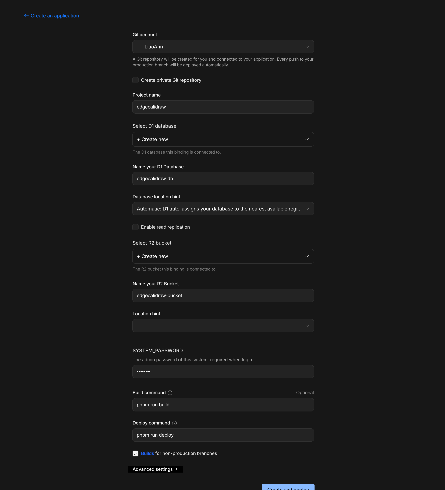
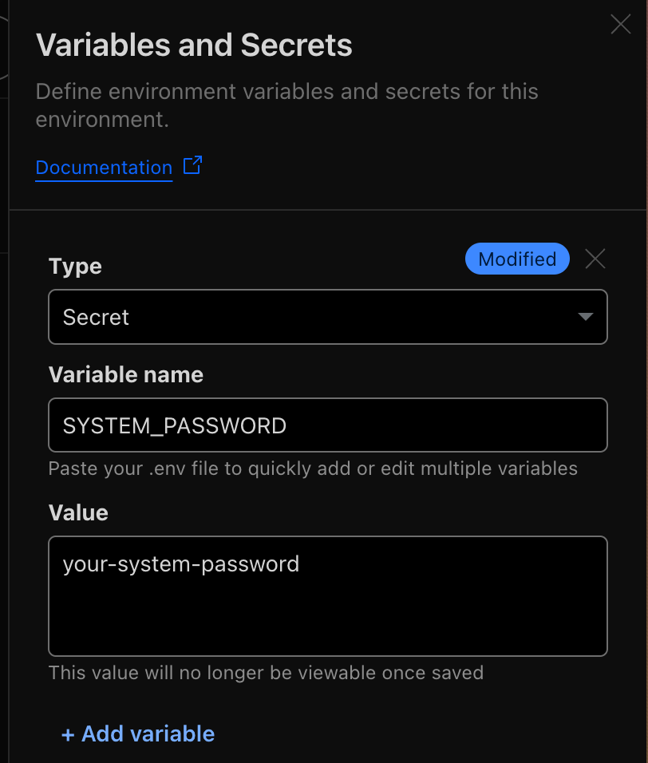

# Edgecalidraw

[](https://deploy.workers.cloudflare.com/?url=https://github.com/LiaoAnn/edgecalidraw)

This repo is inspired by [backpine/learn-durable-objects](https://github.com/backpine/learn-durable-objects), and is a rewrite of it with additional features such as a "room list" for managing multiple drawing rooms, and enhanced real-time collaboration experience based on previous work.

Originally, this tool was developed using [Excalidraw](https://excalidraw.com/). However, the synchronization experience was not as smooth as expected. After discovering [tldraw](https://tldraw.dev/) and its official [Durable Object example](https://github.com/tldraw/tldraw-sync-cloudflare), I decided to switch to tldraw for a better collaborative experience.

## Features

### Room Management

The backend provides a room list feature that allows users to create, delete, and manage drawing rooms. Each room is represented by a unique ID and can be accessed by multiple users simultaneously.

### Real-time Collaboration

After creating a room, you can share the URL with others to collaborate in real-time. The backend uses WebSocket connections to synchronize drawing actions between users, ensuring a smooth collaborative experience.

## Deployment

You can click the "Deploy to Cloudflare" button above to deploy this project directly to your Cloudflare account.

Ensure you have connected your Cloudflare account to your GitHub account, and have the necessary permissions to deploy Workers.

After that, you will see the deployment configuration page. You can re-name the project and database name if you want.



Now you click **Create and deploy** button to start the deployment process. This will take a few minutes to complete, as it will set up the Cloudflare Worker, Durable Objects, and the SQLite database automatically.

After the deployment is complete, you have to set the `SYSTEM_PASSWORD` environment variable in the Cloudflare Workers dashboard. This is used to authenticate the admin user for the room list. Just go to the **Settings** tab, scroll down to the **Variables and Secrets** section, and add a new variable with the name `SYSTEM_PASSWORD` and a strong password as the value.



Click the **Deploy** button to apply the changes. Congratulations! You have successfully deployed Edgecalidraw, you can now access the application at the URL provided in the dashboard. 🎉

## Development

You can use Dev Container to develop this project. Just open the project in VS Code, and it will prompt you to reopen in Dev Container.

If you facing the pnpm permission issue, it maybe caused by the Dev Container's settings.

```json
  "mounts": [
    "source=pnpm_store,target=/home/node/.pnpm-store,type=volume"
  ],
```

You can remove the `mounts` section in `.devcontainer/devcontainer.json` file, and then rebuild the Dev Container.

## Todos

There are still some features to be implemented, such as:

- [x] Real-time laser pointer when collaborating
- [x] Real-time screen following
- [ ] Language switching on whiteboard
- [ ] Change the user name
- [ ] Change the room name
