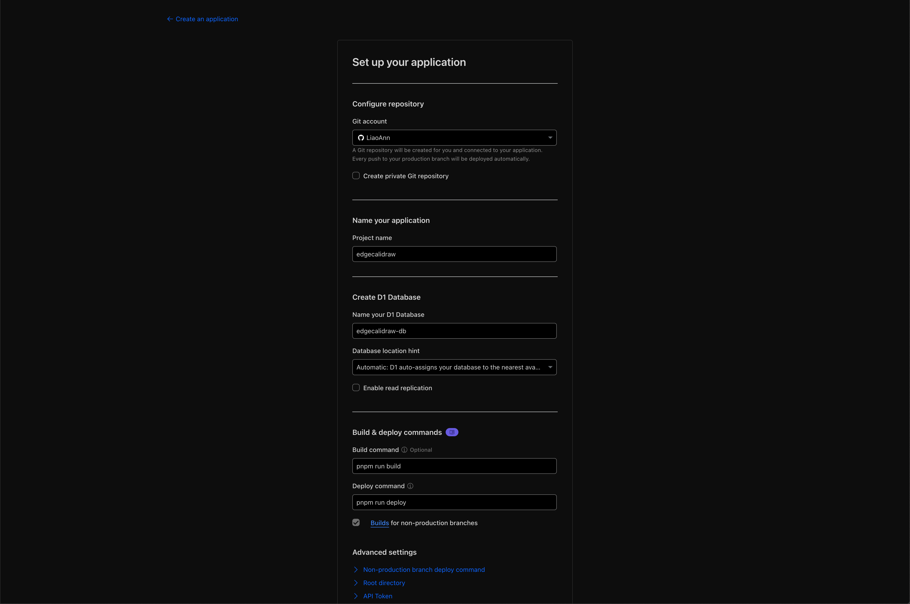

# Edgecalidraw

[](https://deploy.workers.cloudflare.com/?url=https://github.com/LiaoAnn/edgecalidraw)

This repo is inspired by [backpine/learn-durable-objects](https://github.com/backpine/learn-durable-objects), and is a rewrite of it with additional features such as a "room list" for managing multiple drawing rooms, and enhanced real-time collaboration experience based on previous work.

Originally, this tool was developed using [Excalidraw](https://excalidraw.com/). However, the synchronization experience was not as smooth as expected. After discovering [tldraw](https://tldraw.dev/) and its official [Durable Object example](https://github.com/tldraw/tldraw-sync-cloudflare), I decided to switch to tldraw for a better collaborative experience.

## Features

### Room Management

The backend provides a room list feature that allows users to create, delete, and manage drawing rooms. Each room is represented by a unique ID and can be accessed by multiple users simultaneously.

### Real-time Collaboration

After creating a room, you can share the URL with others to collaborate in real-time. The backend uses WebSocket connections to synchronize drawing actions between users, ensuring a smooth collaborative experience.

## Deployment

### Prerequisites

- A Cloudflare account connected to your GitHub account
- Necessary permissions to deploy Cloudflare Workers

### Deploy Steps

**Step 1:** Click the "Deploy to Cloudflare" button above to start the deployment process.

**Step 2:** On the deployment configuration page, you can customize:
- Project name
- D1 database name
- R2 bucket name



**Step 3:** **Important!** Change the `SYSTEM_PASSWORD` environment variable. This password is used to authenticate admin access to the room list.

> [!WARNING]
> The default value in `.dev.vars.example` is `p@ssw0rd`. **You must change this to a secure password before deployment.**

**Step 4:** Click the **Create and deploy** button. The deployment process will:
- Create a new repository in your GitHub account
- Set up Cloudflare Worker and Durable Objects
- Create R2 bucket and D1 database
- Run database migrations automatically

This process typically takes a few minutes to complete.

**Step 5:** After deployment completes:
1. Go to the **Settings** tab in Cloudflare
2. Find your Edgecalidraw URL
3. Start using your own whiteboard! 🎉

## Development

You can use Dev Container to develop this project. Just open the project in VS Code, and it will prompt you to reopen in Dev Container.

If you facing the pnpm permission issue, it maybe caused by the Dev Container's settings.

```json
  "mounts": [
    "source=pnpm_store,target=/home/node/.pnpm-store,type=volume"
  ],
```

You can remove the `mounts` section in `.devcontainer/devcontainer.json` file, and then rebuild the Dev Container.

## Todos

There are still some features to be implemented, such as:

- [ ] Change the user name
- [ ] Change the room name
- [ ] Sync website language with tldraw language
- [ ] Better editor layout
